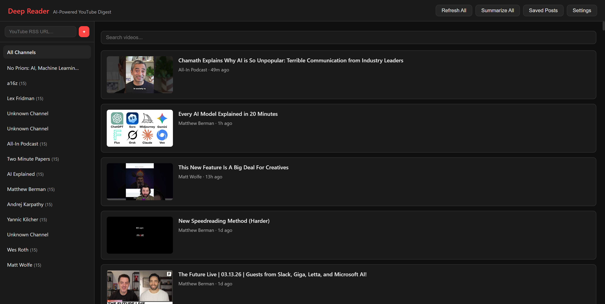
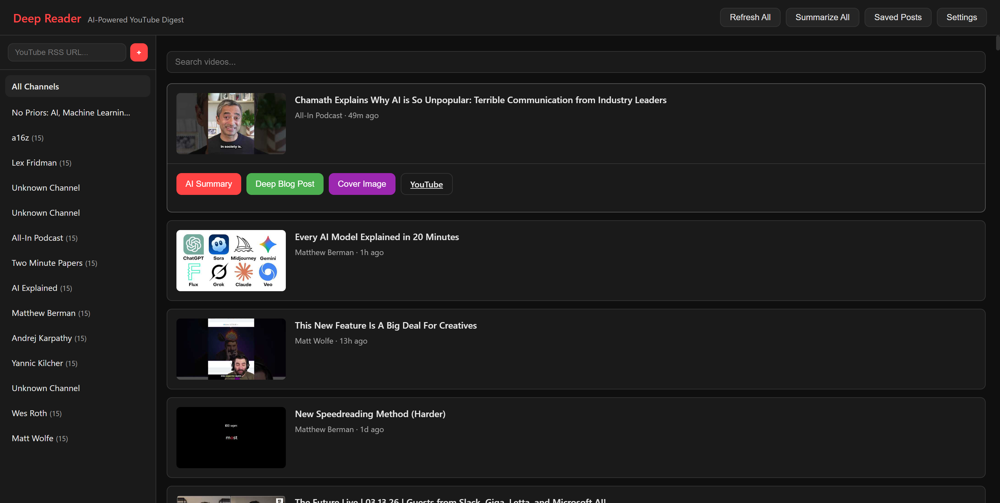
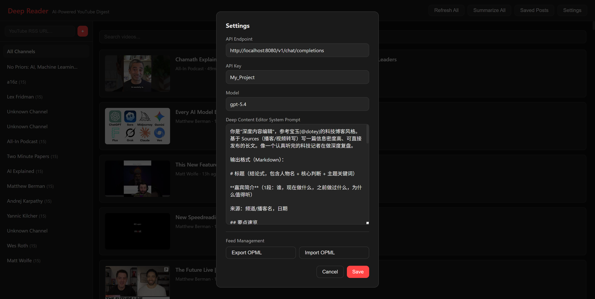
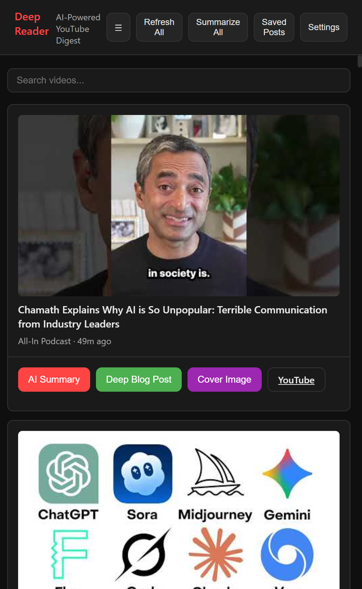

# YouTube RSS Deep Reader

> Turn YouTube subscriptions into AI-powered deep content summaries and publishable blog posts — without watching a single video.

  

## The Problem

You subscribe to 10+ AI/tech YouTube channels. Each publishes 2-3 videos per week. That's 20-30 hours of content you'll never have time to watch. But you still want to stay informed.

## The Solution

YouTube RSS Deep Reader monitors your subscriptions via RSS, fetches video transcripts, and uses AI to generate:

1. **Quick Summaries** — A natural paragraph telling you what the video covers, who's talking, and the key takeaways
2. **Deep Blog Posts** — Full-length, publishable articles in the style of top tech bloggers (inspired by [@dotey](https://x.com/dotey)), with bilingual quotes, structured sections, and facts tables
3. **Cover Images** — AI-generated editorial cover art via Gemini (optional)

All from a single dark-mode panel. No video watching required.

## Features

- **14 Pre-configured AI/Tech Channels** — No Priors, a16z, Lex Fridman, Dwarkesh Patel, All-In Podcast, Andrej Karpathy, and more
- **One-Click AI Summary** — Fetches transcript + generates summary automatically
- **Batch Summarize All** — Generate summaries for all visible videos with progress tracking
- **Deep Blog Post Generation** — Streaming AI output with structured Markdown, bilingual quotes, facts tables
- **Persistent Data** — Summaries and blog posts survive page refreshes (stored in localStorage)
- **File Save System** — Save generated posts as `.md` files with frontmatter metadata
- **Saved Posts Browser** — View, copy, and manage all saved articles
- **Rich Text Copy** — Copy as Markdown or formatted HTML for direct pasting into editors
- **Cover Image Generation** — AI-generated blog covers via Gemini (requires Gemini API access)
- **OPML Import/Export** — Migrate your subscriptions between devices or feed readers
- **Customizable AI Settings** — Endpoint, API key, model, and system prompt all configurable
- **Search & Keyboard Shortcuts** — Filter videos by title/channel/content, Ctrl+K to search
- **Dark Mode UI** — Clean, distraction-free reading experience
- **Mobile Responsive** — Collapsible sidebar with hamburger menu on small screens
- **Add Any Channel** — Paste any YouTube RSS URL or channel URL to add custom feeds

## Screenshots

### Main Feed View

*Dark-mode feed with channel sidebar, video thumbnails, and real-time updates from 14+ AI/tech channels.*

### Video Actions

*Click any video to reveal action buttons: AI Summary, Deep Blog Post, Cover Image generation, and direct YouTube link.*

### Settings Panel

*Configure API endpoint, model, system prompt, and manage feed subscriptions with OPML import/export.*

### Mobile Responsive

*Fully responsive on mobile — collapsible sidebar, touch-friendly controls, and full functionality on small screens.*

### Workflow
```
Subscribe → Refresh → AI Summary → Deep Blog Post → Save/Copy → Publish
```

## Quick Start

### Prerequisites

- **Node.js 18+**
- **An OpenAI-compatible API endpoint** (OpenAI, local proxy, EasyCLI/CLIProxyAPI, etc.)

### Installation

```bash
git clone https://github.com/AlexZWANG1/youtube-rss-deepreader.git
cd youtube-rss-deepreader
npm install
npm start
```

Open `http://localhost:3001` in your browser.

### Configuration

Click **Settings** in the top-right corner to configure:

| Setting | Default | Description |
|---------|---------|-------------|
| API Endpoint | `http://localhost:8080/v1/chat/completions` | Any OpenAI-compatible endpoint |
| API Key | `My_Project` | Your API key |
| Model | `gpt-5.4` | Model name (e.g., `gpt-4o`, `gpt-5.4`, `claude-sonnet-4-20250514`) |
| System Prompt | Deep Content Editor | Customizable blog generation prompt |

### Adding Channels

Paste any of these formats into the sidebar input:
- YouTube RSS URL: `https://www.youtube.com/feeds/videos.xml?channel_id=UC...`
- YouTube Channel URL: `https://www.youtube.com/channel/UC...` (auto-converts)

## Architecture

```
┌─────────────┐     ┌──────────────┐     ┌──────────────────┐
│  Browser UI  │────▶│  Node Server │────▶│ YouTube RSS/API  │
│  (index.html)│     │  (server.js) │     │ (transcripts)    │
│              │     │  Port 3001   │     └──────────────────┘
│              │     │              │
│  AI Calls ───┼────▶│ OpenAI-compat│────▶┌──────────────────┐
│  (direct)    │     │ API Endpoint │     │ Your AI Provider │
│              │     │  Port 8080   │     │ (GPT/Gemini/etc) │
└─────────────┘     └──────────────┘     └──────────────────┘
```

- **Frontend** — Single HTML file, zero build tools, vanilla JS
- **Backend** — Minimal Node.js server (~190 lines) for RSS proxying, transcript fetching, and file management
- **AI** — Direct browser-to-API calls for streaming responses; supports SSE streaming and JSON fallback

## Pre-configured Channels

| Channel | Focus |
|---------|-------|
| No Priors (a16z) | AI deep-dive interviews |
| a16z | Top VC tech insights |
| Lex Fridman | AI/science/philosophy |
| Dwarkesh Patel | Tech leader interviews |
| TheAIGRID | AI news roundup |
| All-In Podcast | Tech/VC/economics |
| Two Minute Papers | AI research summaries |
| AI Explained | AI model deep analysis |
| Matthew Berman | AI tools reviews |
| Andrej Karpathy | Deep AI education |
| Yannic Kilcher | ML paper deep-dives |
| ML Street Talk | Technical ML discussions |
| Wes Roth | AI frontier news |
| Matt Wolfe | AI tools & applications |

## Blog Post Style

Generated posts follow a professional tech blogger format inspired by [@dotey](https://x.com/dotey):

- **Facts table** at the top with key data points
- **Key takeaways** section for quick scanning
- **Structured body** with conclusion-style section headers
- **Bilingual quotes** — Chinese translation + English original in blockquote
- **Speaker attribution** — "Jensen believes..." not stated as fact
- **Technical annotations** — `【Note: xxx refers to...】` for new concepts
- **Source fidelity** — Only information from the transcript, no AI hallucination

## API Compatibility

Works with any OpenAI-compatible chat completions endpoint:

- **OpenAI API** — Direct
- **EasyCLI / CLIProxyAPI** — Local reverse proxy for Gemini CLI, Codex, Claude Code
- **LiteLLM** — Multi-provider proxy
- **Ollama** — Local models with OpenAI compatibility
- **Any /v1/chat/completions endpoint**

## File Structure

```
youtube-rss-deepreader/
├── index.html        # Frontend (single file, ~1570 lines)
├── server.js         # Backend API server (~190 lines)
├── package.json      # Dependencies
├── LICENSE           # MIT License
├── RELEASE_POST.md   # Release announcement (Chinese)
├── screenshots/      # Demo screenshots for README
├── posts/            # Saved blog posts (git-ignored)
├── images/           # Generated cover images (git-ignored)
└── README.md
```

## License

MIT

## What's New in v1.2

- **Batch Summarize All** — One-click AI summaries for all visible videos with real-time progress bar
- **Persistent Data** — Summaries and blog posts survive page refreshes (stored in localStorage)
- **Mobile Responsive** — Collapsible sidebar with hamburger menu on small screens
- **OPML Import/Export** — Migrate subscriptions between devices or feed readers
- **Search & Keyboard Shortcuts** — Filter videos by title/channel/content, `Ctrl+K` to focus search
- **Error Toast Styling** — Visual distinction between success and error notifications

## Contributing

PRs welcome! Some ideas:

- [ ] Auto-summarize on feed refresh
- [ ] Export to Notion/Obsidian
- [ ] Podcast RSS support (not just YouTube)
- [ ] Multi-language summary support
- [ ] Reading list / bookmark system
- [ ] Docker deployment support
- [ ] Browser extension version
